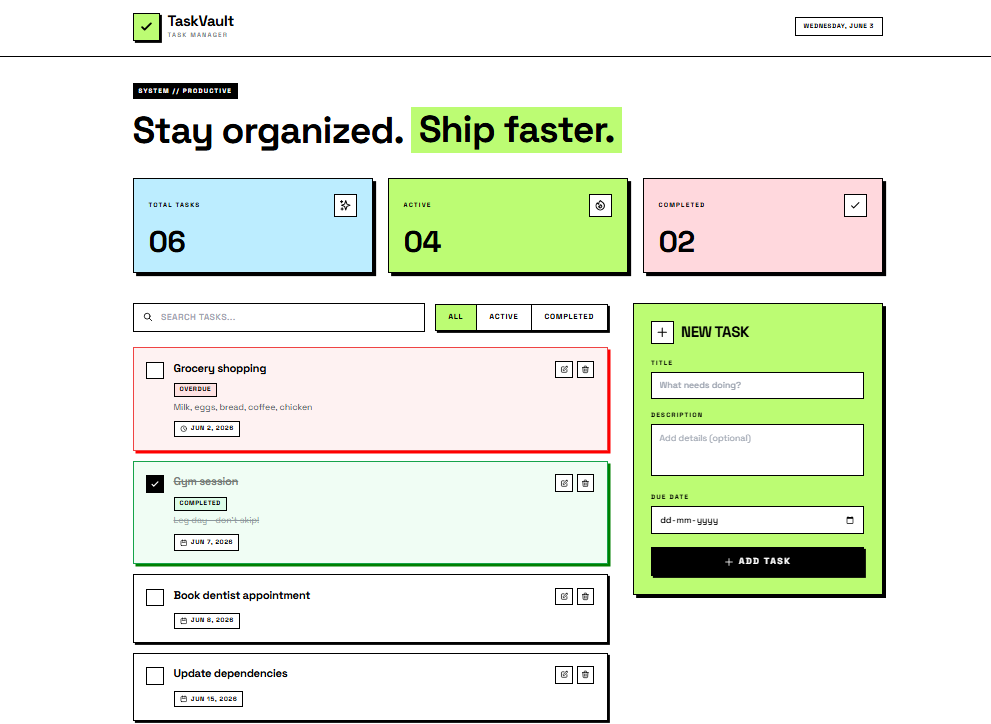

# TaskVault (Personal Task Manager)

## 🚀 Overview

TaskVault is a full-stack task management application that helps users create, manage, update, and organize their daily tasks. It includes task tracking, status management, search, filtering, and persistent storage through a REST API.

## 📸 Screenshot



## 🌐 Live Demo

- Frontend: Coming Soon
- Backend API: Coming Soon

## ✅ Assessment Requirements Coverage

### Must Have

- ✅ Add task
- ✅ View tasks
- ✅ Edit task
- ✅ Delete task with confirmation
- ✅ Toggle task completion
- ✅ Filter tasks

### Should Have

- ✅ Active/completed statistics
- ✅ Overdue task highlighting
- ✅ Empty state UI

### Bonus Features

- ✅ Search by title
- ✅ JSON persistence

## ✨ Features

The following features are fully implemented:

- **Create Task**: Add new tasks with title, optional description, and optional due date
- **Edit Task**: Update an existing task's title, description, and due date using the task form
- **Delete Task**: Remove tasks with confirmation modal to prevent accidental deletion
- **Toggle Status**: Mark tasks as complete or incomplete
- **Search**: Filter tasks by title with real-time search
- **Filter Views**: Switch between All, Active, and Completed tasks
- **Statistics**: Display total, active, and completed task counts
- **Overdue Highlighting**: Visual indicators for tasks past their due date
- **Empty State**: Clean UI when no tasks match current filters
- **Data Persistence**: Tasks are stored in a JSON file on the backend
- **Form Validation**: Frontend and backend validation with user-friendly error messages
- **Sorted Display**: Tasks appear newest-first by creation date

## 🛠️ Tech Stack

### Frontend

- React 18.2
- Vite 5.0
- Axios 1.6
- Tailwind CSS 3.4

### Backend

- Node.js
- Express 4.18
- Zod 3.22 (schema validation)
- CORS 2.8

## 📁 Project Structure

```
Assessment-1/
├── client/
│   ├── src/
│   │   ├── components/
│   │   ├── services/
│   │   ├── App.jsx
│   │   ├── main.jsx
│   │   └── index.css
│   ├── index.html
│   ├── vite.config.js
│   └── package.json
│
└── server/
    ├── config/
    ├── controllers/
    ├── data/
    ├── middleware/
    ├── routes/
    ├── services/
    ├── utils/
    ├── validators/
    ├── app.js
    ├── server.js
    └── package.json
```

## 🔗 API Endpoints

All endpoints are prefixed with `/api/tasks`

| Method | Endpoint      | Description                   |
| ------ | ------------- | ----------------------------- |
| GET    | `/`           | Retrieve all tasks            |
| GET    | `/:id`        | Retrieve a single task by ID  |
| POST   | `/`           | Create a new task             |
| PUT    | `/:id`        | Update an existing task       |
| DELETE | `/:id`        | Delete a task                 |
| PATCH  | `/:id/toggle` | Toggle task completion status |

### Request/Response Examples

**Create Task:**

```json
POST /api/tasks
{
  "title": "Buy groceries",
  "description": "Milk and bread",
  "dueDate": "2026-06-10"
}
```

**Update Task:**

```json
PUT /api/tasks/:id
{
  "title": "Buy groceries and eggs",
  "completed": true
}
```

## ⚙️ Setup Instructions

### Backend Setup

1. Navigate to the server directory:

```bash
cd server
```

2. Install dependencies:

```bash
npm install
```

3. Create environment file:

```bash
cp .env.example .env
```

4. Configure environment variables in `.env`:

```
PORT=5000
NODE_ENV=development
CLIENT_URL=http://localhost:5173
```

5. Start the server:

```bash
npm start
```

For development with auto-reload:

```bash
npm run dev
```

The API will be available at `http://localhost:5000`

### Frontend Setup

1. Navigate to the client directory:

```bash
cd client
```

2. Install dependencies:

```bash
npm install
```

3. Create environment file (optional):

```bash
# Create .env file
VITE_API_URL=http://localhost:5000/api
```

4. Start the development server:

```bash
npm run dev
```

The application will be available at `http://localhost:5173`

### Running Both Services

Open two terminal windows:

Terminal 1 (Backend):

```bash
cd server && npm start
```

Terminal 2 (Frontend):

```bash
cd client && npm run dev
```

## 🎨 Design Approach

The interface follows a neo-brutalist inspired design with strong visual hierarchy, bold borders, clear task states, and high-contrast elements. The goal was to create a clean and visually distinctive task management experience while keeping the application easy to use.

## 📋 Validation

### Frontend Validation

- Title is required
- Title must be at least 3 characters
- Real-time validation feedback as user types
- API calls are prevented when validation fails

### Backend Validation

- Zod schema validation for all requests
- Title: minimum 3 characters (required)
- Description: optional string
- Due date: optional date string (YYYY-MM-DD)
- Completed: optional boolean

Validation errors return a 400 status with descriptive error messages displayed to the user.

## 🎁 Bonus Features Implemented

- **Search Functionality**: Real-time task filtering by title
- **JSON File Persistence**: Server-side data storage without requiring a database

## 💡 Assumptions

This assessment assumes a single-user environment. Authentication and authorization were not implemented as the project focuses on core CRUD functionality, API design, validation, and user interface implementation.

## 🤖 AI Assistance

Claude and ChatGPT were used for brainstorming, debugging assistance, UI refinement, and documentation support. All project requirements, feature implementation, testing, integration, and final verification were completed and reviewed by me.

## 🔮 Future Improvements

- Add user authentication and authorization
- Implement task categories or tags
- Add task priority levels
- Support for recurring tasks
- Export tasks to CSV/JSON
- Dark mode support
- Drag-and-drop task reordering
- Task collaboration features
